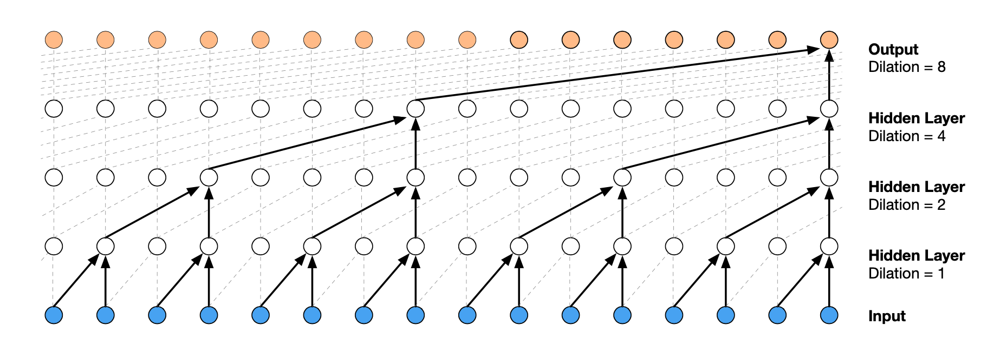

# Research Log

This is a log of different approaches, techniques, and other thoughts relating
to the project as it evolves.

**Note:** _For the best viewing experience, we recommend installing the_
_[markdown diagrams browser extension](https://github.com/marcozaccari/markdown-diagrams-browser-extension)_
_to render all of the diagrams_ and _[mathjax (chrome)](https://github.com/orsharir/github-mathjax)_
for math rendering.

## References

[wave_net]: https://arxiv.org/abs//1609.03499
[wave_net_autoencoders]: https://arxiv.org/abs/1901.08810
[juke_box]: https://arxiv.org/abs/2005.00341
[open_pose]: https://arxiv.org/abs/1812.08008
[dancing_to_music]: https://arxiv.org/pdf/1911.02001v1.pdf

- [Wavenet: A Generative Model for Raw Audio][wave_net]
- [Unsupervised speech representation learning using WaveNet autoencoders][wave_net_autoencoders]
- [Jukebox: A Generative Model for Music][juke_box]
- [OpenPose: Realtime Multi-Person 2D Pose Estimation using Part Affinity Fields][open_pose]
- [Dancing to Music][dancing_to_music]


## Problem Statement

**03/11/2021**

The goal of the `movenet` is to create an instrument from human body
movement - to translate that motion into music.


The prior research enumerated in the [resources](./README.md#resources) section
should provide ample inspiration for this project, most of which are concerned
with the inverse problem: translating music into some representation of human
movement. In principle, we can use similar architectures to map a sequence of
images (i.e. video) into a raw audio waveform.

## WaveNet: A Strong Baseline Candidate

**03/20/2021**

The objective of this project is to produce high quality music given a video
input of a human dancing. In order to achieve this, the *audio decoder* must
have enough capacity to generate qualitatively good samples.

A strong baseline model for this task might be the [WaveNet][wave_net] model,
which has been demonstrated to generate high-quality raw audio samples. In fact,
when trained on music, the WaveNet model was able to produce what the authors
report generating samples that "were often harmonic and aesthetically pleasing,
even when produced by unconditional models". What makes WaveNet a good candidate
for this project is that we can condition the output on both static and
sequential inputs.

Reproducing the WaveNet model in the context of conditioning on video input
will be the first phase of this project.

### Potential Issue: Deterministic Outputs

We can anticipate issues some issues with the baseline model.

A potential issue with the WaveNet model is that the outputs are deterministic
with respect to the conditioning inputs. This issue may be solved by using
variational methods as described in [Chorowski et al. 2019][wave_net_autoencoders],
where they use variational autoencoders (VAE) to capture latent representations
of speech waveforms in an autoencoder setting. While this paper used VAEs to solve
the problem of learning to better disentangle different high-level semantics of
the input, e.g. acoustic content and speaker information, we can use these
methods in this project to also produce non-deterministic outputs as a function
of video input. The hope is that that same exact movement might produce
qualitatively different sounds.

VAE methods are a potential direction to go once the baseline has been
established. Other work to consider is [Jukebox][juke_box].

## WaveNet: Implementing a Baseline Model for movenet

Unlike other music generation systems like [WaveNet][wave_net] or
[Jukebox][juke_box], we want to condition the generated output on a sequence
of vectors representing movement of the human body. This might be a sequence
of raw images or a sequence of 2D body keypoints represented via a model like
[OpenPose][open_pose], which was the approach taken by
[Lee et al. 2019][dancing_to_music].

The benefit of using 2D body keypoints is that it's a lower-dimensional
representation of the human body and would remove much of the unimportant
details that a CNN would have to learn to ignore with video data.

### Prototype Model

To get a proof-of-concept completed as quickly as possible, we'll go for an
approach that:

1. Remains as faithful to the WaveNet architecture as possible.
2. Minimizes the number of components that depend on pre-trained models for
   pre- or post-processing.

WaveNet is an autoregressive model that operates directly on raw audio waveform
in the following factorization:

$p(x) = \prod_{t=1}^{T} p(x_t | x_1,... , x_{t - 1})$

This is an important aspect of the architecture to preserve because not only do
we want to generate music from human dance, we also want to produce music that
maintains thematic consistency and coherence over relatively long time spans.

We also want to condition the sampled audio value based on the previous dance
pose, so we have a second timeseries $h_t$, which potentially has a higher or
lower sampling frequency than the audio signal.

$p(x | h) = \prod_{t=1}^{T} p(x_t | x_1,... , x_{t - 1}, h_t, ..., h_{t - 1})$

We can transform $h_t$ using a CNN with pooling to downsample the video framerate,
if the video sample frequency is higher than the audio signal, or a transposed
convolutional network to upsample the video sample frequency if the converse is
true. Ultimately we'll want to have a sequence $y = \phi(h)$ with the same
resolution as the audio signal, where $\phi$ can be a learnable up/downsampling
convolutional filter or a deterministic re-sampling function that wraps a
third-party video frame resampling library.

### Activation Function

We'll use the gated activation units using in the [WaveNet][wave_net] paper,
conditioned on the second time series $y$ (see section 2.5):

$z = tanh(W_{f, k} * x + V_{f, k}^T h)\ \odot\ \sigma(W_{g, k} * x + V_{g, k} * y)$

Where:
- $z$ is the activation
- $W$ is the learnable audio convolutional filter
- $x$ is the audio signal
- $V$ is the learnable video convolutional filter
- $y$ is the up/downsampled video signal
- $k$ is the convolutional layer index
- $f$ and $g$ denote filter and gate, respectively.

### Data Processing

#### Representing Human Dance

For the baseline prototype we'll go with CNNs to represent (a) individual
image frames in a video sequence and (b) represent a sequence of image
representations via the up/downsampling CNN described above to produce the
sequence `y` that has the same sampling frequency as the audio signal.

#### Processing Audio

To model the audio signal, we'll follow the preprocessing step described in
the [Wavenet][wave_net] paper (section 2.2) to quantize the 16-bit integer
values of raw audio into 256 possible values with the mu-law companding
transformation:

$f(x_t) = sign(x_t) \frac{ln(1 + \mu |x_t|)}{ln(1 + \mu)}$

Where $-1 < x_t < 1$ and $\mu = 255$.

### Dataset

At a high level, the types that we can use to compose the dataset for this
project will look like the following:

```
AudioSample = Array[256 x 1]
VideoSample = Array[height x width x n_channels]
Sample = Tuple[AudioSample, VideoSample]
TrainingInstance = List[Sample]
Dataset = List[TrainingInstance]
```

### Model Architecture

As mentioned above, we'll follow the conditional wavenets architecture, which
is an autoregressive model that outputs a raw audio sample for the next time
step `t + 1` conditioned on the previous audio and video samples
`{t, t - 1, ..., 1}`. Figure 3 in the [Wavenet][wave_net] paper visualizes
dilated causal convolutions, which increases the receptive of the model.



Because the audio signal is encoded in a categorical space of 256 possible
values, the loss for this task will be cross entropy loss.

See the [paperswithcode](https://paperswithcode.com/paper/wavenet-a-generative-model-for-raw-audio)
entry for reference implementations of the wavenet model.
